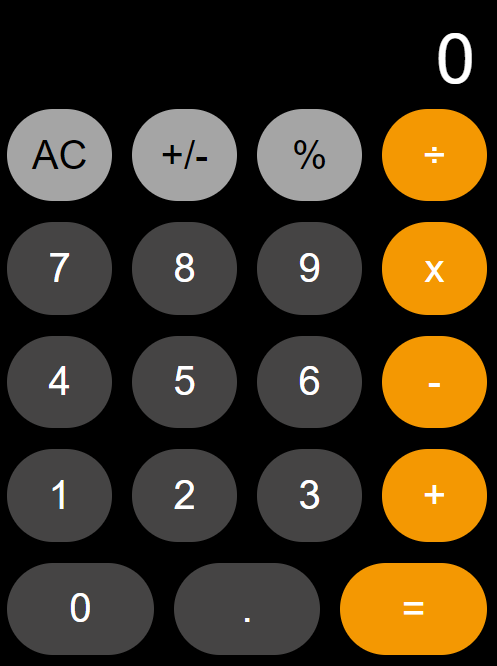

# Calculator
iOS Calculator Clone written in JavaScript with React.

I had a lot of fun creating this and utilizing the Big.js library for helping handle the decimal points and arithmetic logic. I tried to get this as close as possible to the exiting iOS Calculator, even by making the button colors fade when pressed. Enjoy! 

## Deployment
https://kfly-calculator.netlify.com/ 

Responsive to a variety of screen sizes! My favorite is using it like it's the size on the iPhone 8 Plus (414 x 736). You should be able to size it to whatever size you are comfortable with.

## Built With
For this application I built this entirely with the following: 
* [JavaScript](https://www.w3schools.com/js/)
* [React](https://reactjs.org/docs/getting-started.html)
* [ReactDOM](https://reactjs.org/docs/react-dom.html)
* [PropTypes](https://reactjs.org/docs/typechecking-with-proptypes.html)
* [CSS](https://www.w3schools.com/css/)
* [Big.js](https://yarnpkg.com/en/package/big.js)

## Author
* [Kaitlyn Flynn](https://kaitlynflynn.com/)

## License
[MIT License](https://github.com/kaitlynflynn/Calculator/blob/master/LICENSE)  
Copyright (c) 2019 Kaitlyn Flynn